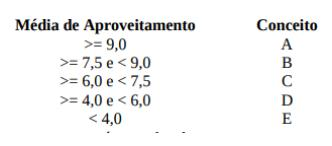

Faça um programa usando HTML, JS e CSS que lê o número de identificação (RA), o nome do aluno e as 4 notas obtidas por um aluno nas 4 verificações e a média dos exercícios que fazem parte da avaliação. Calcular a média de aproveitamento, usando a fórmula: 
   ``` 
   MA = (Nota1 + Nota2 x 2 + Nota3 x 3 + Nota4 x 4 + ME )/11
   ``` 
        A atribuição de conceitos obedece a tabela abaixo:

<p align="center">
  
</p>

A resposta deve mostrar o número do aluno, o nome do aluno, suas notas, a média dos exercícios, a média de aproveitamento, conceito correspondente e a mensagem: APROVADO se o conceito for A,B ou C e REPROVADO se o conceito for D ou E.


Pode usar alguma IA, as cores devem ser com predominância de branco e os destaques com azul em vários tons. Deve-se considerar avisos no footer, mudando a cor de fundo para vermelho com fonte em branco.